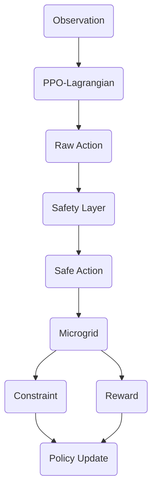

# Safe & Carbon-Aware DRL for Data Center Microgrids

A research-oriented energy management platform demonstrating **Safe Reinforcement Learning** in microgrid environments.

## Research Objectives
This project explores the optimization of behind-the-meter data center microgrids using a **Constrained Markov Decision Process (CMDP)** framework. The goals are:
1. **Carbon-Aware Dispatch**: Adapting IT load and storage actions to real-time grid carbon intensity.
2. **Safety-Constrained Optimization**: Utilizing PPO-Lagrangian to satisfy SoC and power constraints.
3. **Multi-Objective Trade-offs**: Balancing economic cost, emissions, and battery degradation.

## Methodology Note
To provide a comprehensive research demo, this platform utilizes:
- **PPO-Lagrangian Agent**: A Safe-RL controller balancing rewards and dynamic constraint penalties ($\lambda$).
- **Deterministic Safety Layer**: A hard-coded filter ensuring physical feasibility of battery actions.
- **Explainable Analysis**: Synthetic training traces are provided in the "DRL Model Analysis" tab to demonstrate the theoretical convergence behavior of CMDP solvers.

## System Architecture


## Features
- **DRL Model Analysis**: Training rewards, constraint costs, and Lagrangian multiplier evolution.
- **Policy Behavior Mapping**: Visualizing how the agent responds to prices, carbon, and SoC.
- **Strategy Benchmarking**: Comparing Rule-based, Greedy, and Safe DRL policies.
- **Pareto Frontier Analysis**: Understanding the trade-off between cost and carbon.

## Installation & Run
1. Install dependencies:
   ```bash
   pip install -r requirements.txt
   ```
2. Run the platform:
   ```bash
   streamlit run app.py
   ```
